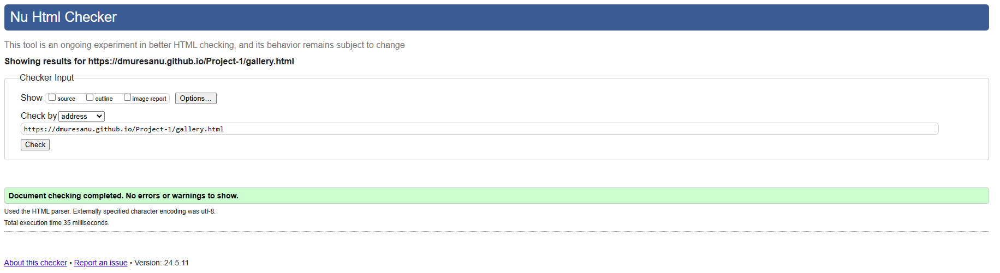

[View the live project here](https://dmuresanu.github.io/Project-1/index.html)

Glamour Glow is primarily a makeup salon located in Ballinacurra, Co. Cork, Ireland. The salon offers professional makeup services for various occasions, including weddings, parties, and other special events. The goal of Glamour Glow is to help clients achieve stunning looks, enhancing their natural beauty with expert makeup application techniques.

Target Audience - The website targets several key groups:

- Women Planning Special Events: Brides-to-be, bridesmaids, and women attending special events like proms, parties, and ceremonies.
- Local Residents and Visitors: Women living in or visiting the Ballinacurra and greater Co. Cork area who are looking for professional makeup services.
- Beauty Enthusiasts: Individuals interested in beauty, fashion, and makeup trends who are seeking professional services to enhance their appearance.

Purpose of the Website - The website serves several important functions:

- Information Hub: It provides essential information about the services offered by Glamour Glow, including the types of makeup applications available and details about the salon's location and contact information.
- Contact and Booking: The site includes a contact form that allows potential clients to reach out to the salon for inquiries, appointments, and consultations. This makes it easier for customers to connect with the business directly.
- Showcase Portfolio: Through a gallery section (as indicated by the "Gallery" link in the navigation), the website showcases examples of the makeup work done by Glamour Glow, helping to attract new clients by demonstrating the quality and style of their services.
- Customer Engagement: Links to social media platforms help build an online presence and community, enabling clients to follow, interact with, and stay updated on the salon’s latest news and promotions.
- Business Hours and Location: The inclusion of Google Maps and opening hours helps customers plan their visits and ensures they know when the salon is open, making the business more accessible and user-friendly.

## Index – Table of Contents
* [User Experience (UX)](#user-experience-ux) 
* [Features](#features)
* [Design](#design)
* [Technologies Used](#technologies-used)
* [Testing](#testing)
* [Deployment](#deployment)
* [Credits](#credits)

## User Experience (UX)

-   ### User stories

    -   #### A. First Time Visitor Goals

        1. As a First Time Visitor, I want to easily understand the main purpose of the site.
        2. As a First Time Visitor, I want to be able to easily navigate throughout the site to find content.
        3. As a First Time Visitor, I want to be able to easily navigate and view previous work done by the salon and book an appointment.
        4. As a First Time Visitor, I want to be able to easily find where the organisation is located.

    -   #### B. Returning Visitor Goals

        1. As a Returning Visitor, I want to be able to access and view the gallery quickly and easily.
        2. As a Returning Visitor, I want to be able to check opening times quickly and easily.
        3. As a Returning Visitor, I want to be able to contact the organisation to book an appointment or to give feedback or ask questions.

    -   #### C. Frequent User Goals
        1. As a Frequent User, I want to be able to sign-up easily for discounts.
     

## Features

### Existing Features

-   __F1 Navigation Bar__

    - The navigation bar has a consistent look and placement on all three pages of the website supporting easy navigation.  It includes a simple Logo, Home page, Gallery and Contact links and is responsive on multiple screen sizes.  On small screens (e.g. mobile devices) the Home, Menu and Contact links move into a dropdown menu on the right-hand side

      
    

-   __F2 Landing Page image and call to action__

    - The landing area includes a photograph and a text that together clearly identify the purpose of the business and the type of service it sells. 

    - A "Book Your Appointment" button is placed central to the screen as an eye-catching call to action which gives the user an obvious quick route to the contact page.

      

- __F3 Ideals__

    - The company ideals are presented using 3 sections on the main page.  These sections give the user more information about the company in relation to its mission and services provided.
    
      

- __F4 Testimonials__

    - The customers feedback is presented using testimonial sections on the main page.  These sections give the user more information about the feedback received in relation to its services provided.
    
      

- __F5 Footer__

    - The footer is featured on all three pages and is identical on each page making it easy to use.  It contains four sections :

        - Address - similar to the opening times, the address of this type of business is important to the user in order for them to use the company and so has been repeated on each page in the footer to allow the user to quickly and easily find out where the company is located 

        - Opening Times - having the opening times in the footer on each page allows the user to quickly and easily find this information, this is important for this type of business as it is information that the user needs in order to make use of the company (product is sold offline).

        - Follow Us - this area has links to social media sites associated with the organisation encouraging the user to keep connected.  The links will open in a new tab to allow easy navigation for the user. The organisation can use these sites to promote brand awareness and keep customers interested through updates, offers, chats and other marketing efforts. (As THRIVE is a ficticious company, the links currently just go to the social media main websites.)

        - Don't Miss Out - this area has a quick form that the user can use to subscribe to the company newsletter so is not missing out on tips and special offers

      

- __F6 Gallery page__

    - The gallery page gives a portofolio of past cutomers where users can see the services provided by Glamour Glow
    
    - A "Book Your Appointment" button is placed central under the portofolio as an eye-catching call to action which gives the user an obvious quick route to the contact page.

       

- __F07 Contact Page - 'Contact Us'__

    - The 'Contact Us' panel of the Contact page allows the user to send a message/give feedback to the company and if they want, sign up to the company mailing list to get discount codes and offers.  The user is asked to provide their name and email address when sending a message.  By default, the option to join the mailing list is set to 'no' - to prevent them accidentally signing up for the mailing list and getting unwanted email.  Sending the message will result in a new tab showing the results (at the moment the user is simply shown the formdump.codeinstitute.net page with the data they submitted displayed)

      

- __F08 Contact Page - 'Our Location'__

    - The 'Our Location' panel of the Contact page gives the user an interactive google map showing the location of the company along with details on full address in large font to make it easily readable.  By clicking the 'View larger map' link the user can go to the google maps site for the address - this opens in a separate tab to allow ease of navigation.

      

### Features which could be implemented in the future

- __Company Timeline__
    - A 'Company Timeline' page could be added to provide more information on the evolution of the business for users who would like to know more about the origins of the company, its ethos and its involvement with the community.

- __Booking system implementation__
    - Allows efficient allocation of staff and resources by providing real-time visibility into appointment schedules and availability.

    - Provides a centralized system for managing appointments, client information, and staff schedules, leading to better organization and coordination.

    - Clients can easily reschedule or cancel appointments online, providing flexibility for both parties and reducing the need for manual adjustments.

    - Demonstrates professionalism and modernity, aligning with industry standards and expectations, and instilling confidence in potential clients.

## Design

-   ### Imagery
    -   The hero and large background images were meticulously selected to exude a warm and inviting ambiance, perfectly aligned with the essence of a makeup salon. Each image was chosen with the intention to convey professionalism, health, and beauty, thereby harmonizing with the primary goal of delivering exceptional makeup artistry services.

-   ### Colour Scheme
    -  The color palette was picked to make the website feel cozy and welcoming, just like stepping into Glamour Glow. The deep brown adds a touch of class and professionalism, while the lighter brown tones keep things friendly and relaxed. Together, they set the stage for a place where everyone feels at home while getting pampered.

        

-   ### Typography
    -   Google Fonts were used to import Great Vibes, Josefin Sans, Montserrat and Playfair Display fonts into styles.css.  These were chosen as they create a visually engaging and harmonious design. These fonts blend elegance, modernity, and readability, enhancing the overall aesthetic and user experience. This thoughtful mix ensures that the text is both attractive and easy to read, contributing to a polished and professional look throughout the website.

## Technologies Used

### Languages Used

-   [HTML5](https://en.wikipedia.org/wiki/HTML5)
-   [CSS3](https://en.wikipedia.org/wiki/Cascading_Style_Sheets)

### Frameworks, Libraries & Programs Used

-   [Google Fonts:](https://fonts.google.com/) was used to import the 'Lato' and 'Oswald' fonts into the style.css file which are used on all pages of the project.
-   [Font Awesome:](https://fontawesome.com/) was used to add icons for aesthetic and UX purposes.
-   [Git:](https://git-scm.com/) was used for version control by utilising the Gitpod terminal to commit to Git and Push to GitHub.
-   [GitHub:](https://github.com/) is used as the respository for the projects code after being pushed from Git.

## Testing

### Validator Testing

- [HTML Validator](https://validator.w3.org/)

    - result for index.html
      
    - result for gallery.html
      
    - result for contact.html
      

- [CSS Validator](https://jigsaw.w3.org/css-validator/)

    - result for styles.css 
      
   

### Google lighthouse testing

### index.html

### gallery.html

### contact.html

## Deployment

> To deploy the project I followed these steps starting from the main project repository [here](https://github.com/dmuresanu/Project-1).

 1. Clicked on `Settings` on the navigation menu in the repository
 2. I then selected the `Pages` menu on the side bar.
 3. In the first dropdown menu labeled `Source` I selected the branch of the name `main` from the dropdown.
 4. In the next dropdown labeled `/root` I left as the default option.
 5. Selected Save
 
> I then received a notification from GitHub that my project is being deployed and after about 1 minute & a couple of refreshes of the page it was ready and live.

 
## Credits 

### Code

- Code on how to do a rounded button as seen on the Home page was based on code on : [W3Schools Rounded button tutorial](https://www.w3schools.com/howto/howto_css_round_buttons.asp)
- Code on how to include google map with marker was based on code from this site :  [How to embed Google Map](https://www.maps.ie/create-google-map/)
- Code on how to implement flex boxes was based on instructions from [YouTube Flexbox Tutorial](https://www.youtube.com/watch?v=S0a7PEOi0do)

### Media 

- The icons in the header, footer and on the back of the flip-cards were taken from [Font Awesome](https://fontawesome.com/)
- The fonts used were imported from [Google Fonts](https://fonts.google.com/)

- All images belong to me and my wife as she is a Makeup Artist

### Acknowledgments

- Thank you to my mentor Alan Bushell who gave me very good advice and feedback on how to plan and execute this project.